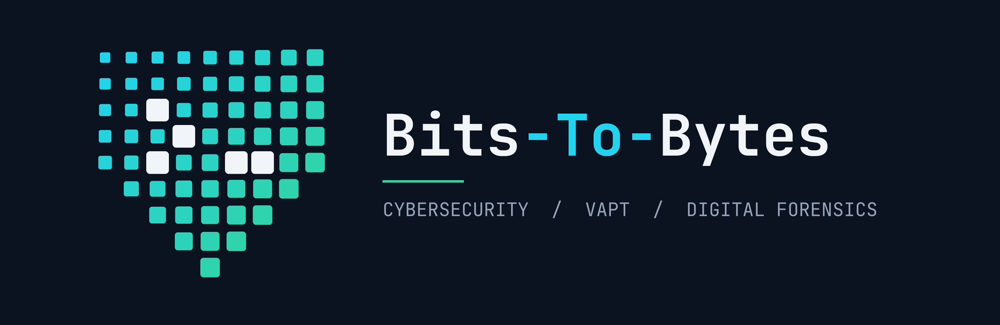

### Abhinav Praveen
**Information Security & Digital Forensics Student · Aspiring VAPT / SOC / DFIR Analyst**

---

## 👋 About Me

I'm a B.Sc. **Information Security and Digital Forensics** student at Karunya Institute of Technology and Sciences, Coimbatore, focused on **offensive security, security monitoring, and digital forensics**.

I learn by doing: I practise on hands-on platforms, build small security tools, and document everything I find so the work can be checked and reused.

## 🎯 Career Goal

> Seeking a **6-month cybersecurity internship (VAPT / SOC / DFIR) starting December 2026**, where I can contribute to real security work and grow into a security analyst.

| Focus area | What I'm building towards |
|---|---|
| 🔓 **VAPT** | Web application and network testing: OWASP Top 10, Burp Suite, Nmap, clear pentest reporting |
| 🛡️ **SOC / Blue Team** | Log analysis, SIEM monitoring, detection rules, incident investigation |
| 🔍 **Digital Forensics** | Evidence integrity, disk and memory analysis, timelines, forensic reports |

---

## 🛠️ Skills & Tools

| Area | Details |
|---|---|
| **Security testing** | OWASP Top 10, web application testing, network reconnaissance, service enumeration |
| **Forensics & IR** | Evidence handling, FTK Imager, incident response basics, SHA-256 integrity checks |
| **Networking** | TCP/IP, OSI model, DNS, ARP, HTTP/HTTPS |

---

## 🚀 Projects

### ✅ [HTTP Security Header Checker](https://github.com/Bits-To-Bytes-cy/http-header-checker)
A Python CLI tool that scans a website's HTTP response headers and scores them against 8 modern security best practices, with Pass / Warning / Fail findings and one-line fixes.

- Value-level checks for HSTS, CSP, and more (not just "header present")
- Cookie-flag analysis and information-leak detection
- JSON output and a `--fail-under` exit code for CI use
- 81 automated tests with mocked network calls; GitHub Actions CI

`Python` `Requests` `Rich` `Pytest` `GitHub Actions`

### 🚧 In Progress

| Project | Goal | Status |
|---|---|---|
| **Web Application Pentest Report** | Test OWASP Juice Shop with Burp Suite and write a professional report with CVSS scoring and remediation | 🚧 In progress |
| **Home SOC Lab (Wazuh SIEM)** | Simulate attacks, write detection rules, and document incident tickets mapped to MITRE ATT&CK | 📅 Planned |
| **Digital Forensics Case Study** | Analyse a public disk/memory image with Autopsy and Volatility and produce a forensic report | 📅 Planned |

---

## 📜 Certifications & Learning

| | |
|---|---|
| 🎓 **Cisco Networking Academy** | Junior Cybersecurity Analyst Career Path · Introduction to Cybersecurity |
| 🎓 **Fortinet** | Certified Fundamentals in Cybersecurity (FCF) |
| 🏆 **CipherCop Hackathon 2025** | Finalist |
| 🧪 **TryHackMe** | Level 4 · Top 30% · 13 rooms completed |
| 🧪 **PortSwigger Web Security Academy** | Learning path in progress |

---

## 📫 Let's Connect

I'm open to **internship opportunities** and conversations with security professionals.

- 💼 LinkedIn: [abhinav-praveen-av](https://www.linkedin.com/in/abhinav-praveen-av)
- 📧 Email: [abhinavpraveenav@gmail.com](mailto:abhinavpraveenav@gmail.com)
- 🧪 TryHackMe: [abhinavpraveen](https://tryhackme.com/p/abhinavpraveen)

*Bits to Bytes: learning security one hands-on lab at a time.*

